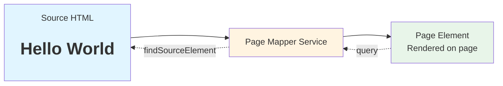
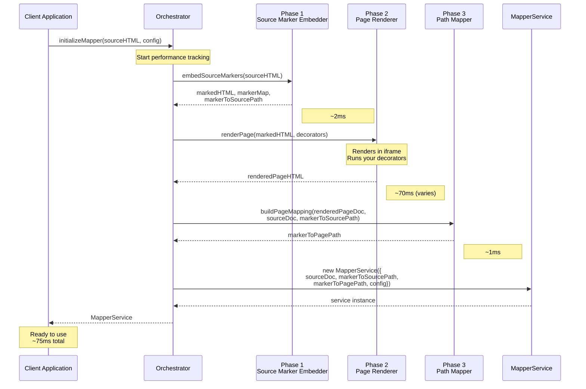
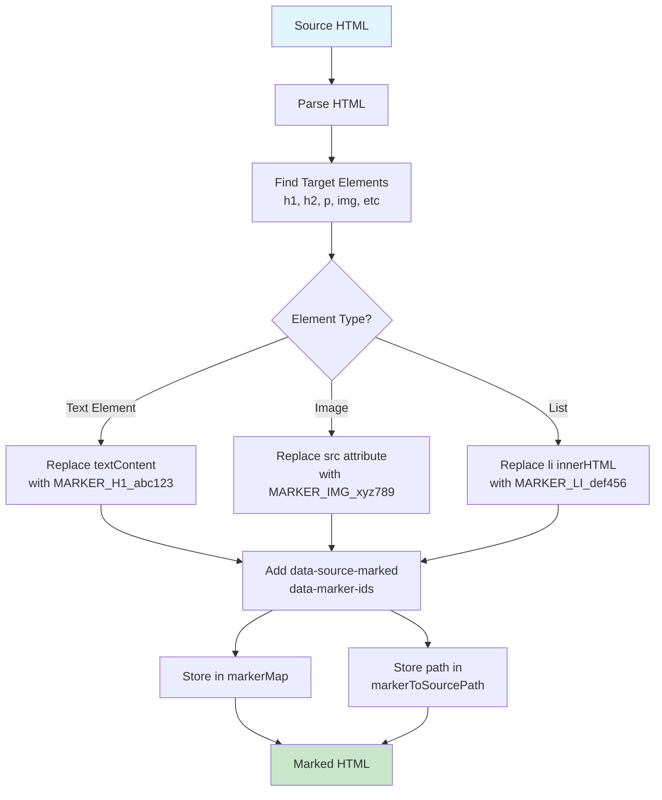
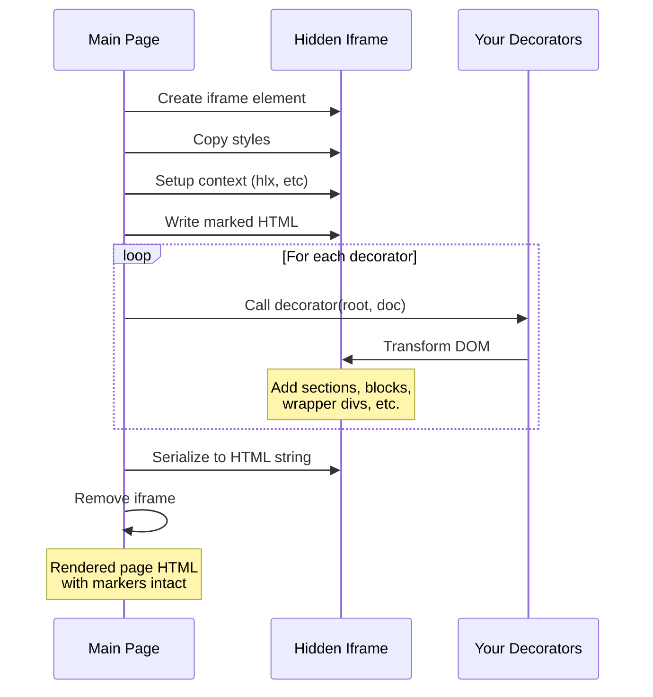
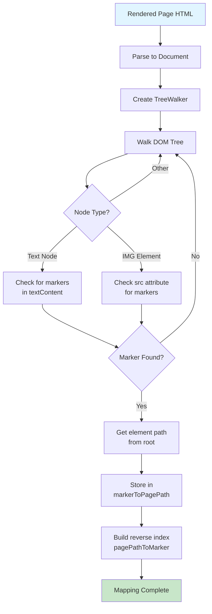
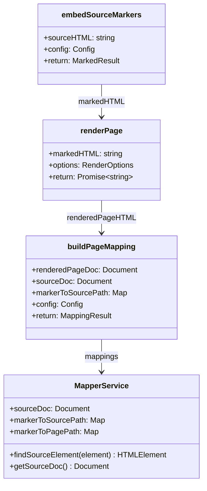
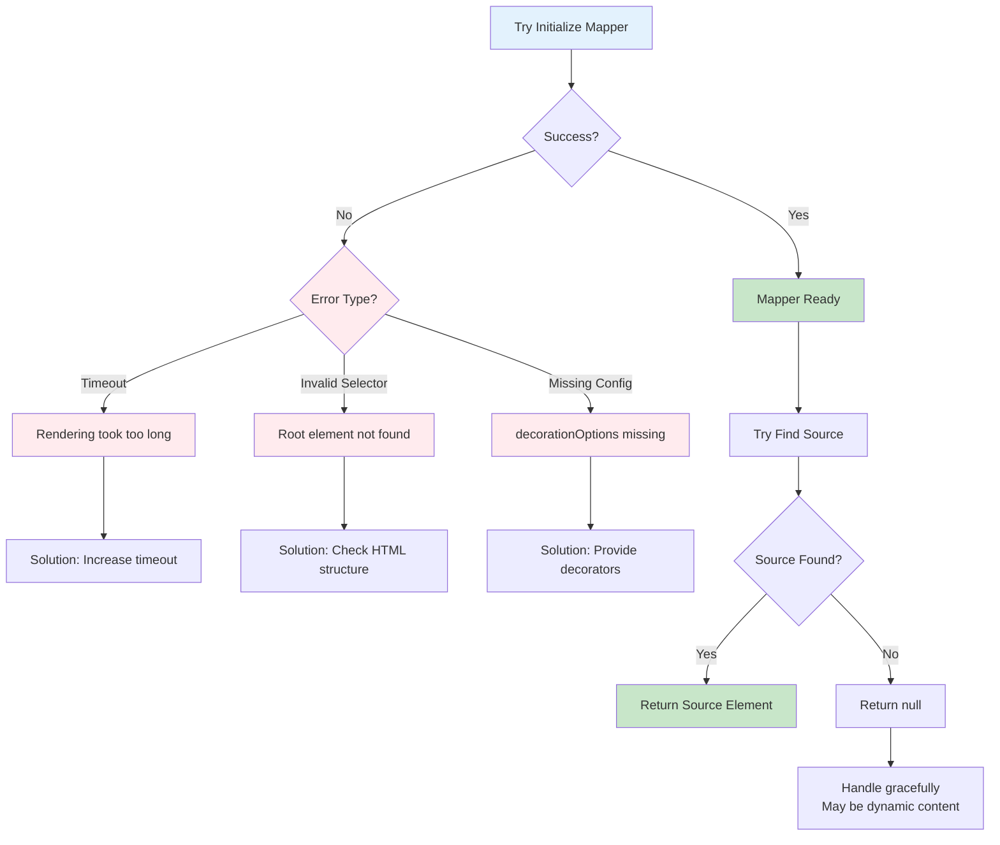
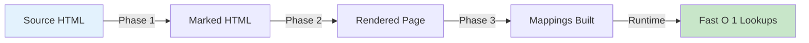

# Page Mapper: Flow Diagrams & API Documentation

This document provides detailed flow diagrams showing how the Page Mapper works internally and how client applications can use it.

## Table of Contents

1. [High-Level Overview](#high-level-overview)
2. [Initialization Flow](#initialization-flow)
3. [Three-Phase Process](#three-phase-process)
6. [API Contracts](#api-contracts)

---

## High-Level Overview



**Key Insight:** The Page Mapper creates a bidirectional mapping that allows you to:
- Given a **page element** → find its **source element** ✅
- Given a **source element** → find its **page element** (future feature)

---

## Initialization Flow



**Timeline:**
1. **Start** → Client calls `initializeMapper()`
2. **~2ms** → Phase 1 complete (markers embedded)
3. **~70ms** → Phase 2 complete (page rendered)
4. **~1ms** → Phase 3 complete (mapping built)
5. **~75ms total** → Service ready for use (varies by page complexity)

---

## Three-Phase Process

### Phase 1: Source Marker Embedding



**Output Data Structures:**

```javascript
// markerMap: Original content storage
Map {
  "MARKER_H1_abc123" => { type: 'html', value: 'Hello', element: 'H1' },
  "MARKER_P_xyz789" => { type: 'html', value: 'World', element: 'P' },
  "MARKER_IMG_def456" => { type: 'attribute', name: 'src', value: 'a.jpg', element: 'IMG' }
}

// markerToSourcePath: Structural positions
Map {
  "MARKER_H1_abc123" => [{ tag: "DIV", index: 0 }, { tag: "H1", index: 0 }],
  "MARKER_P_xyz789" => [{ tag: "DIV", index: 0 }, { tag: "P", index: 0 }]
}
```

### Phase 2: Page Rendering




### Phase 3: Path Mapping



**Output Data Structure:**

```javascript
// markerToPagePath: Where markers are in rendered page
Map {
  "MARKER_H1_abc123" => [
    { tag: "DIV", index: 0 },      // .section
    { tag: "DIV", index: 0 },      // .wrapper
    { tag: "H1", index: 0 }        // <h1>
  ]
}

// pagePathToMarker: Reverse index for fast lookup
Map {
  '[{"tag":"DIV","index":0},{"tag":"DIV","index":0},{"tag":"H1","index":0}]' 
    => "MARKER_H1_abc123"
}
```

---

## API Contracts

### Public API

```typescript
// Main initialization function
async function initializeMapper(
  sourceHTML: string,
  config?: Config
): Promise<MapperService>

// Service interface
class MapperService {
  // Find source element for a page element
  findSourceElement(pageElement: HTMLElement): HTMLElement | null
  
  // Get the source document
  getSourceDoc(): Document
  
  // Internal maps (exposed for advanced usage)
  markerToSourcePath: Map<string, Path>
  markerToPagePath: Map<string, Path>
  config: Config
}
```

### Configuration Interface

```typescript
interface Config {
  rootSelector: string           // Default: 'main'
  targetSelectors: string[]      // Default: ['h1','h2',...,'p','img']
  hashPrefix: string             // Default: 'HASH_' (for markers)
  hashIdLength: number           // Default: 8
  timeout: number                // Default: 10000
  logPerformance: boolean        // Default: true
  decorationOptions: {
    decorators: Function[]       // Your rendering functions
    setupContext?: Function      // Optional iframe setup
    rootSelector: string         // Same as config.rootSelector
    timeout: number              // Same as config.timeout
  }
}
```

### Advanced API (Direct Component Usage)



### Type Definitions

```typescript
type Path = Array<{
  tag: string    // Element tag name (e.g., 'DIV', 'P')
  index: number  // Child index within parent
}>

interface MarkerInfo {
  type: 'html' | 'attribute'
  value: string
  element: string
  name?: string  // For attribute type (e.g., 'src')
}

interface RenderOptions {
  decorators: Function[]
  setupContext?: Function
  rootSelector: string
  timeout: number
}
```

---

## Error Handling

### Error Scenarios Flow



### Error Handling Code Pattern

```javascript
try {
  // Initialize mapper
  const mapper = await initializeMapper(sourceHTML, {
    decorationOptions: {
      decorators: [/* your decorators */],
      rootSelector: 'main',
      timeout: 10000,
    }
  });
  
  // Try to find source
  const sourceEl = mapper.findSourceElement(pageEl);
  
  if (!sourceEl) {
    console.warn('No source element found - might be dynamic content');
    // Handle gracefully
    return;
  }
  
  // Process source element
  processEdit(sourceEl);
  
} catch (error) {
  if (error.message.includes('timeout')) {
    // Rendering took too long
    console.error('Mapper initialization timeout. Try increasing timeout.');
  } else if (error.message.includes('element found')) {
    // Root selector issue
    console.error('Root element not found. Check your HTML structure.');
  } else {
    // Other error
    console.error('Mapper initialization failed:', error);
  }
  
  // Fall back to non-edit mode
  disableEditMode();
}
```

---

## Performance Characteristics

### Initialization Performance

```mermaid
gantt
    title Page Mapper Initialization Timeline
    dateFormat SSS
    axisFormat %L ms
    
    section Phase 1
    Embed Markers           :a1, 000, 2ms
    
    section Phase 2
    Render Page             :a2, 002, 70ms
    
    section Phase 3
    Build Mapping           :a3, 072, 1ms
    
    section Ready
    Service Ready           :milestone, a4, 073, 0ms
```



### Runtime Performance

| Operation | Time | Complexity | Details |
|-----------|------|------------|---------|
| **Initialization** |
| Phase 1: Embed Markers | ~2ms | O(n) | One pass through source |
| Phase 2: Render Page | ~70ms | O(n) | Depends on decorators |
| Phase 3: Build Mapping | ~1ms | O(n) | Walk rendered DOM |
| **Total Init** | **~75ms** | **O(n)** | One-time cost (typical page) |
| **Runtime Lookups** |
| findSourceElement() | ~0.1ms | O(1) | Map lookups + path walk |
| getSourceDoc() | ~0.001ms | O(1) | Direct property access |

**Actual Performance (36 elements):**
- Embedding: 2.10ms
- Rendering: 66.40ms  
- Mapping: 1.00ms
- Total: 69.70ms

---


## Summary

### Key Workflow



### Key Benefits

The Page Mapper provides a **fast, reliable, and scalable** solution for mapping rendered page elements back to their source elements.

✅ **Performance**
- O(1) lookups (< 0.1ms per call)
- One-time initialization (~75ms for typical pages)
- Handles 1000+ elements efficiently

✅ **Reliability**
- Works with complex transformations
- Handles duplicate content
- No modification of live page

✅ **Flexibility**
- Framework-agnostic design
- Configurable selectors
- Injectable rendering functions

### Best Use Cases

- 🎨 Live editing systems
- 📝 Content management tools
- 📊 Analytics and tracking
- 🔧 Developer tools and inspectors

### Quick Integration

```javascript
// Initialize once
const mapper = await initializeMapper(sourceHTML, config);

// Use repeatedly (fast!)
const sourceEl = mapper.findSourceElement(pageEl);
```

That's it! 🎉

For more details, see:
- [README.md](./README.md) - User guide and examples
- [ARCHITECTURE.md](./ARCHITECTURE.md) - Technical architecture
